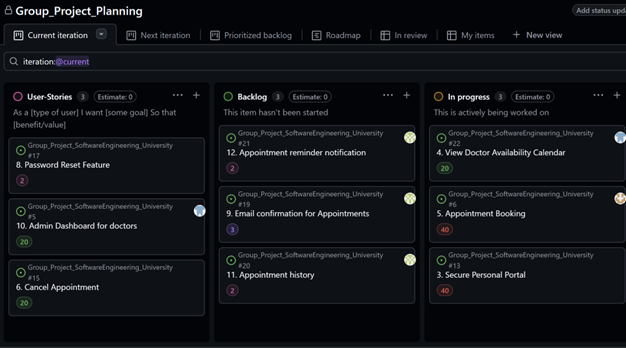
The repository board provides a detailed view of how tasks are actively managed andprogressed during the sprint using a structured workflow. It is organised into columns suchas User Stories, Backlog, and In Progress, allowing the team to clearly track thestatus of each feature at any given time. This setup supports transparency andensures that all team members are aware of current priorities and responsibilities.From the board, it is evident that key features such as appointment booking, viewingdoctor availability, and the secure personal portal have been moved into the InProgress stage, indicating that the team is actively working on delivering core patientfunctionality. Meanwhile, additional features like appointment reminders, emailconfirmations, and appointment history remain in the Backlog, showing plannedfuture work that will enhance the overall user experience once the main system isstable.This workflow reflects an effective use of Agile practices, where tasks arecontinuously prioritized and progressed based on importance and dependencies. By breaking down the project into manageable user stories and visually tracking theirmovement across stages, the team is able to maintain organization, improvecollaboration, and ensure steady progress towards delivering a fully functionalpatient-centered system.
   
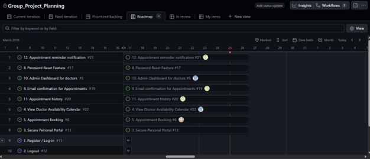
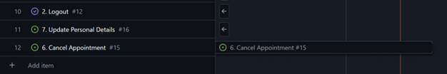
The GitHub roadmap illustrates how our team has organized and prioritized userstories across the project timeline, providing a clear visual representation of sprintplanning and task progression. The roadmap includes key features such asappointment booking (6), doctor availability (22), secure personal portal (13), andauthentication features like register/login (11) and logout (12). These tasks aredistributed across specific dates, showing how the team plans to incrementallydeliver functionality while maintaining a structured workflow.From the roadmap, foundational features such as authentication and secure accessare prioritized early, as they are essential for enabling patients to safely interact withthe system. Core patient-centric features, including viewing doctor availability andbooking appointments, are also scheduled early in the timeline to ensure that thesystem delivers immediate value to users. Additional enhancements, such asappointment reminders (21), email confirmations (19), and appointment history (20),are planned afterwards to improve user experience and system usability.The roadmap also reflects our Scrum-based approach, where tasks are organizedinto manageable units and tracked visually to monitor progress. Each item representsa user story from our backlog, and their placement on the timeline demonstratesprioritization based on dependencies and user value. This structured planning ensures that the team remains aligned to sprint goals and can deliver a functional,patient-focused system in incremental stages.
   
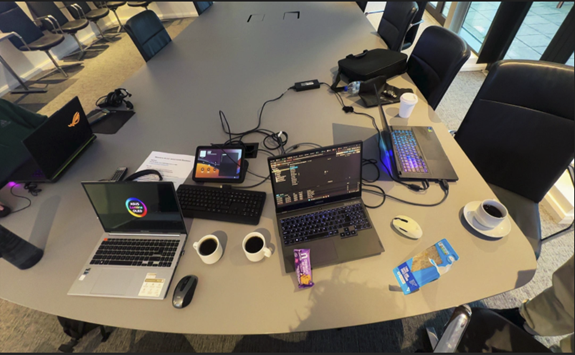
To support our teamwork and collaboration, the group regularly meet in person twicea week by booking study rooms at the university. These sessions allowed us to worktogether in a focused environment, where we could discuss ideas, solve problems,and make progress on both frontend and backend development tasks. Working face-to-face improved our communication and ensured that all team members werealigned with the project goals and sprint tasks.During these meetings, we often worked simultaneously on our individualresponsibilities while also helping each other when needed, particularly whenintegrating frontend and backend components. The submitted image providesevidence of one of these sessions, showing the team actively engaged on theirlaptops while collaborating on the project. This demonstrates our commitment toconsistent teamwork, effective time management, and active participation throughoutthe development process.
   
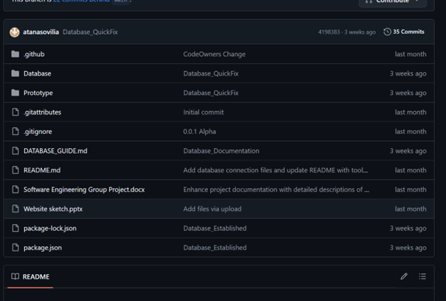
The GitHub repository serves as the central hub for all project development,containing the full codebase, documentation, and version history of our system. It isstructured into clearly organized folders such as Database and Prototype, whichseparate backend development and initial design work, making the project easier tonavigate and maintain. Key files such as the README.md andDATABASE_GUIDE.md provide essential documentation, outlining how the systemis set up and how different components interact, ensuring that all team members canunderstand and contribute effectively.The repository also demonstrates consistent version control practices through regularcommits, with updates reflecting progress in areas such as database setup,documentation improvements, and feature development. Files like package. Jsonand package-lock. Json indicate dependency management, while additional projectdocuments, including design sketches and reports, show the planning anddevelopment process beyond just coding. This highlights a well-rounded approach tosoftware engineering, combining both technical implementation and supportingdocumentation.Overall, the repository reflects effective team collaboration and organization. Bymaintaining all project assets in one place and using version control to trackchanges, the team ensures transparency, accountability, and the ability to managecontributions from multiple members. This approach supports an efficientdevelopment workflow and aligns with industry-standard practices for collaborativesoftware projects.
   
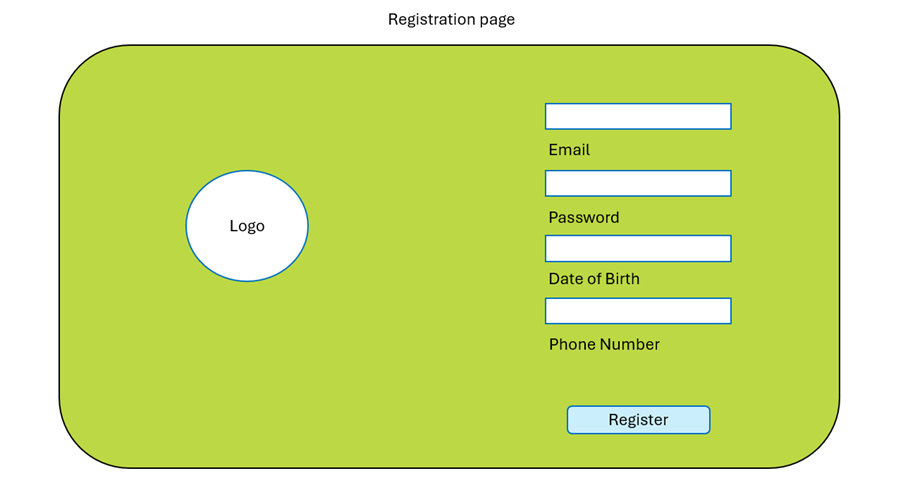
**Wireframe 1 - Register:** The registration wireframe as you can see is an early design sketch just to visualize how we want the register page to look like in the final iteration.
   
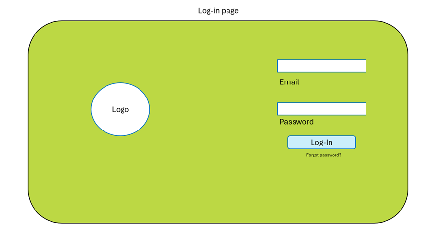
**Wireframe 2 - Login:** The login wireframe as you can see is an early design sketch just to visualize how we want the login page to look like in the final iteration.
   
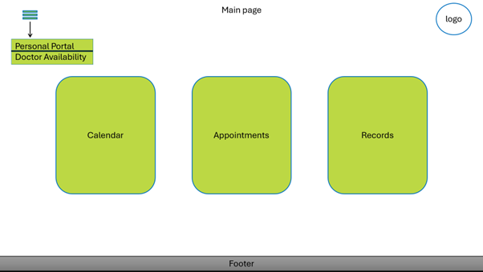
**Wireframe 2 - Homepage:** The main page wireframe is to access your personal portal and doctor availability. You cancheck the live calendar, book an appointment and check the records.
   
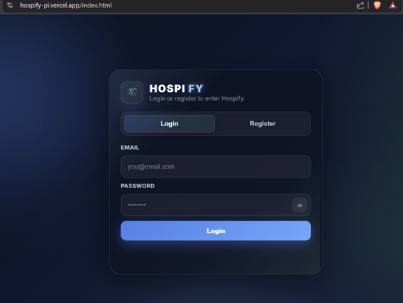
**Login Page Interface:** This screenshot shows the implemented login page of the system, where patients can securely enter their email and password to access their account. The interface includes input validation to ensure required fields are completed before submission. If incorrect credentials are entered, the system displays an appropriate error message, preventing unauthorised access. This feature demonstrates the frontend design integrated with backend authentication logic, forming a core part of the patient-centred system.
   
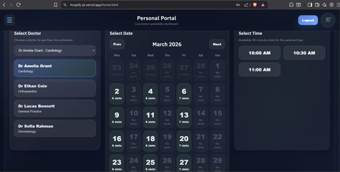
**Doctor Availability and Appointment Booking Interface:** This screenshot demonstrates the fully implemented doctor availability and appointment booking feature within the patient’s personal portal. After successfully logging in, the user is redirected to this dashboard, where they can interact with a real-time scheduling system. On the left-hand side, patients can select from a list of available doctors, each labelled with their specialization (e.g. cardiology, orthopaedics, general practice, dermatology). This allows users to make informed decisions based on their medical needs.

The central section displays an interactive calendar view, showing available dates along with the number of appointment slots for each day. Dates with no availability are clearly indicated, while selectable dates highlight the number of open slots, providing transparency and improving usability. Navigation controls such as “Prev” and “Next” allow users to move between months, ensuring flexibility when scheduling future appointments.
On the right-hand side, the system dynamically displays available time slots for the selected date, broken down into 30-minute intervals. Users can easily choose a suitable time, making the booking process intuitive and efficient. This feature integrates frontend design with backend logic, where real-time availability is retrieved from the system’s database and updated dynamically. Overall, this interface demonstrates a key patient-centred functionality, enabling users to view doctor schedules and book appointments seamlessly in one place.
   
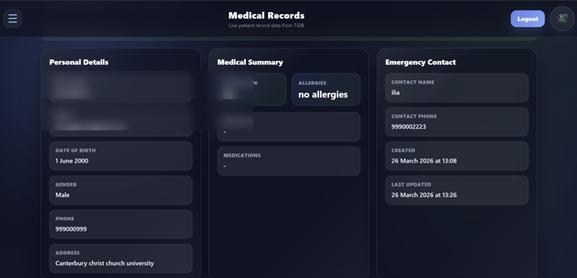
**Medical Records Portal Interface:** This screenshot shows the implemented medical records portal, where patients can securely access and view their personal health information after logging into the system. Sensitive details such as the patient’s name and email have been blurred for privacy purposes. The interface is divided into clear sections, including personal details, medical summary, and emergency contact information, providing a structured and user-friendly layout.

The personal details section displays key patient information such as date of birth, gender, phone number, and address, while the medical summary includes important health data such as blood type, allergies, diagnosis, and medications. On the right-hand side, emergency contact details are presented along with timestamps indicating when the record was created and last updated. This ensures transparency and keeps the patient informed about their data.

This feature demonstrates the integration between the frontend interface and the backend database, where patient data is securely stored and retrieved in real time. Access control mechanisms ensure that users can only view their own records, maintaining data privacy and security. Overall, this functionality fulfils a core requirement of the system by enabling patients to conveniently access their medical information in a clear and secure manner.
   
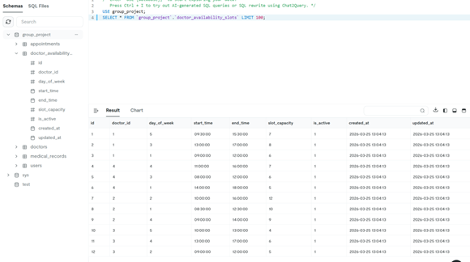
**Backend Database - Appointment Records:** This screenshot shows the backend database structure used to manage appointment records within the system. It includes key fields such as user ID, Doctor ID, appointment date, appointment time, and status (e.g. confirmed or pending), along with timestamps indicating when the record was created. These fields demonstrate how the system stores and organises appointment data in a structured format, allowing efficient retrieval and management of bookings.

The use of unique identifiers for both users and doctors ensure that each appointment is correctly linked to the relevant patient and healthcare provider. The status field enables the system to track whether an appointment has been confirmed, cancelled, or is still pending, which is essential for maintaining accurate scheduling. Additionally, the inclusion of creation timestamps supports auditing and tracking of user activity within the system.

This backend implementation highlights the integration between the database and the application logic, where data is dynamically stored and retrieved to support features such as appointment booking and real-time availability. It provides strong evidence of backend functionality, demonstrating that the system is not only visually functional but also supported by a robust and well-structured data management system.
   
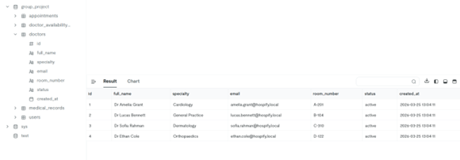
**Backend Database — Doctor Information:** This screenshot displays the backend database table used to store and manage doctor information within the system. The table includes key fields such as the doctor’s full name, speciality, email address, and assigned room number, along with a status field indicating whether the doctor is currently active or not. This structured format ensures that all relevant details about each doctor are stored consistently and can be easily accessed by the system.

The inclusion of a status field (active/inactive) allows the system to control which doctors are available for appointment booking, directly supporting the real-time availability feature. For example, inactive doctors can be excluded from the booking interface, preventing patients from selecting unavailable practitioners. Additionally, storing specialization information helps patients choose the appropriate doctor based on their medical needs, improving the overall user experience.

This database design demonstrates strong backend implementation, as it supports dynamic data retrieval and integration with the frontend interface. It ensures that accurate and up-to-date doctor information is presented to patients, forming a critical part of the appointment booking and availability system.
   
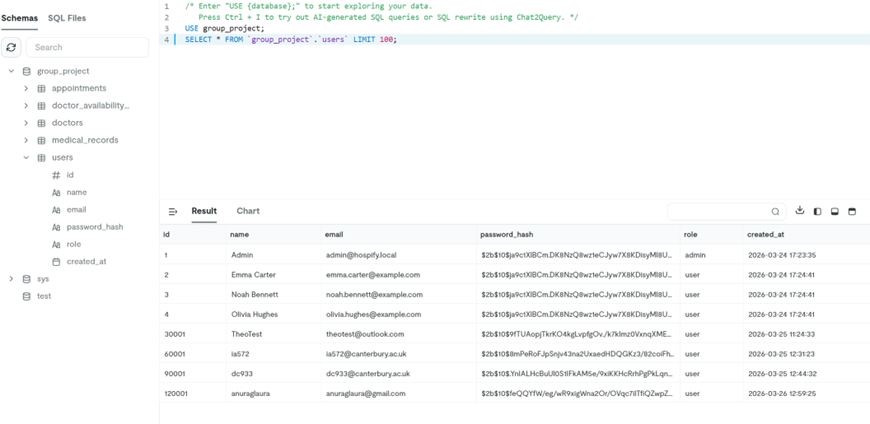
**Backend Database — User Authentication Data:** This screenshot shows the backend database table responsible for storing user authentication details. It includes key fields such as the user’s name, email address, password hash, role (e.g. user or admin), and a timestamp indicating when the account was created. This structure demonstrates how the system securely manages user accounts and supports the login and registration functionality.

The use of a password hash instead of storing plain-text passwords highlights the implementation of secure authentication practices. By encrypting user passwords (e.g. using bcrypt), the system protects sensitive information and reduces the risk of data breaches. The role field allows for potential role-based access control, enabling the system to differentiate between standard users and administrators, which can be expanded in future development.

Additionally, the inclusion of timestamps helps track when users register or interact with the system, supporting monitoring and auditing. This backend implementation provides strong evidence of a secure and well-structured authentication system, forming a critical foundation for protecting patient data, and enabling controlled access to system features.